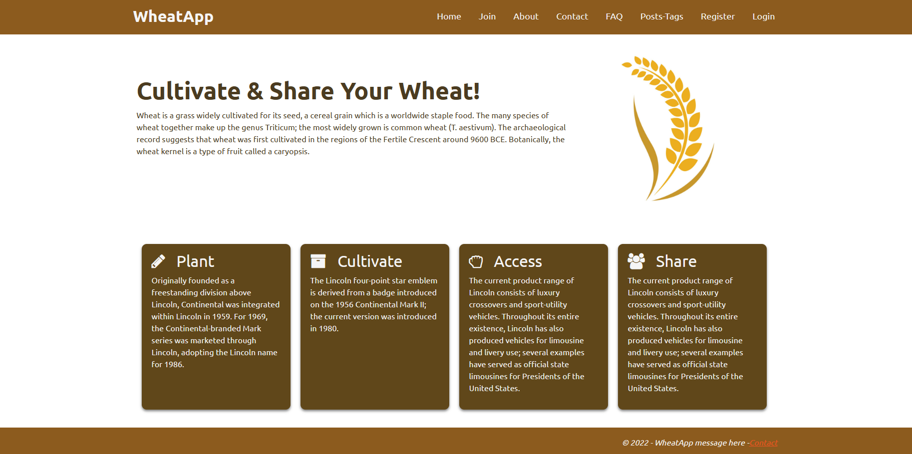
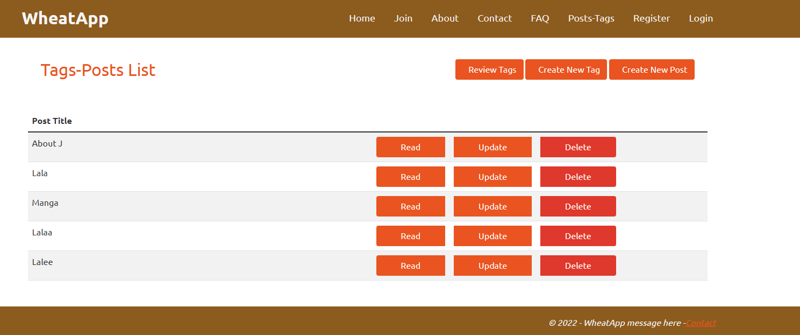
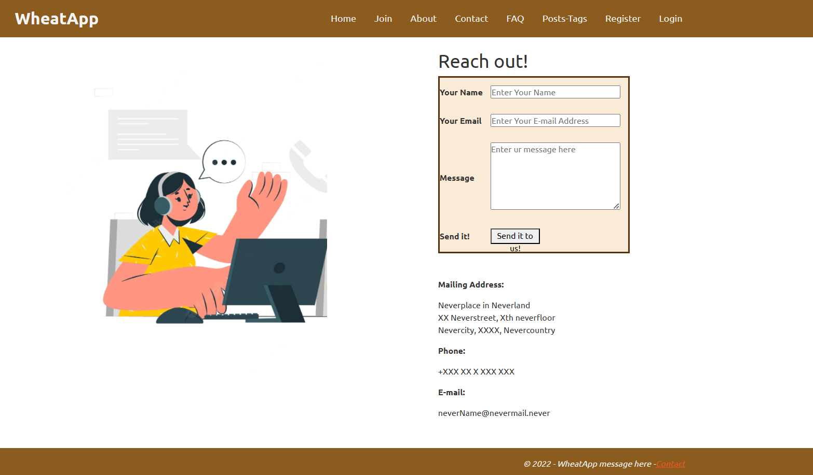
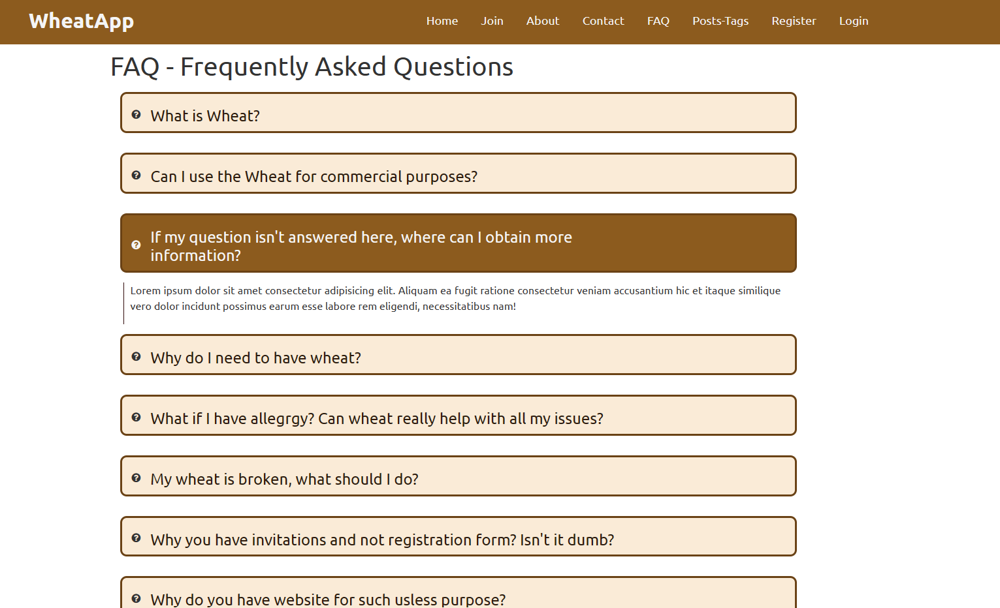

# ASP .NET Project with Front-End and MSSQL Server

This project is a simple ASP .NET web application that combines front-end design with MSSQL Server for back-end functionality. Here's a brief overview of the main steps involved:

## Front-end setup

All the front-end static files (excluding HTML) such as CSS, JS, images, and videos are placed inside the "wwwroot" directory, and organized in respective folders.

## HTML/CSS partitioning

The static and dynamic parts of the website design are identified: Static portions like navigation, logo, footer, etc., are placed in the `_Layout.cshtml` file, while the dynamic content is inside the `Index.cshtml` file.

## Razor syntax and partial views

Razor syntax to render dynamic data and utilize partial views for semantically different front-end parts like sliders are used. This ensures separation of concerns and maintainability of the code.

## Controller and views

Corresponding controller actions for each separate page in the front-end are created. Since the content is static, the controller actions are only returning the appropriate views.

## Dynamic form functionality

Dynamic forms are implemented by creating a model class inside the "Models" folder. Validation attributes are applied to properties and corresponding migrations are generated to update the database. GET and POST controller actions are set up to render and process form data, storing valid information in the database.

## Additional page and CRUD functionality

A new page with post and tag details are added, along with forms to create posts and tags. A many-to-many relationship is established between posts and tags, the relationship using fluent API is configured, and CRUD operations are handled using a dedicated controller.
